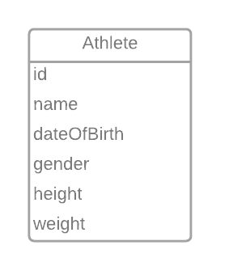
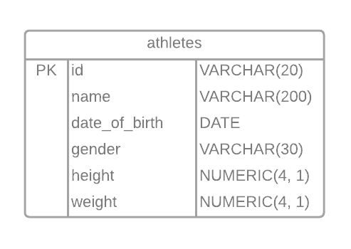

# University Project

Name | Student Number | Email
-----|----------------|------
Chloé Dumas | 300072427 | dduma032@uottawa.ca

## Deliverable 1

J'ai utilisé LucidChart pour faire les diagrammes.

Un athlète aura les propriétés suivantes 
- id
- name
- date of birth
- gender
- height
- weight

### Diagramme ER



### Diagramme relationnel



### Schema SQL

La base de données a été créé avec Postgres.

```
CREATE DATABASE crossfit;
```

La ligne SQL suivante va créer le schema athletes.

```
CREATE TABLE IF NOT EXISTS athletes (
    id VARCHAR(20) PRIMARY KEY,
    name VARCHAR(200),
    date_of_birth DATE,
    gender VARCHAR(30),
    height NUMERIC(4,1),
    weight NUMERIC(4,1)
);
```

### Exemple de SQL

#### INSERT

La ligne SQL suivante ajoute 7 athletes dans la table 'athletes'

```
INSERT INTO athletes (id, name, date_of_birth, gender, height, weight) 
VALUES 
    ('1', 'Sansone Donaway',  '2000-05-24', 'male',       171.4, 89.6),
    ('2', 'Milissent Prazer', '1999-02-26', 'female',     155.4, 69.0),
    ('3', 'Kippy Toman',      '1991-04-03', 'female',     154.1, 73.5),
    ('4', 'Garvy Eakens',     '1999-01-03', 'male',       168.5, 96.1),
    ('5', 'Scotti Sleford',   '1995-08-02', 'male',       179.2, 99.6),
    ('6', 'Nicolis Brickham', '1977-02-12', 'non-binary', 178.4, 80.1),
    ('7', 'Rolfe Pigram',     '1986-03-07', 'male',       175.5, 75.0);
```

Résultat après l'exécution

id | name | date_of_birth | gender | height | weight
------- | ------- | ------- | ------- | ------- | -------
1 | Sansone Donaway | 2000-05-24 | male | 171.4 | 89.6
2 | Milissent Prazer | 1999-02-26 | female | 155.4 | 69.0
3 | Kippy Toman | 1991-04-03 | female | 154.1 | 73.5
4 | Garvy Eakens | 1999-01-03 | male | 168.5 | 96.1
5 | Scotti Sleford | 1995-08-02 | male | 179.2 | 99.6
6 | Nicolis Brickham | 1977-02-12 | non-binary | 178.4 | 80.1
7 | Rolfe Pigram | 1986-03-07 | male | 175.5 | 75.0

#### UPDATE

La ligne SQL suivante mets à jour la grandeur de l'athlete avec id = 1 (Sansone Donaway)

```
UPDATE athletes
SET height = 172.8
WHERE id = '1';
```

Résultat après l'exécution

id | name | date_of_birth | gender | height | weight
------- | ------- | ------- | ------- | ------- | -------
2 | Milissent Prazer | 1999-02-26 | female | 155.4 | 69.0
3 | Kippy Toman | 1991-04-03 | female | 154.1 | 73.5
4 | Garvy Eakens | 1999-01-03 | male | 168.5 | 96.1
5 | Scotti Sleford | 1995-08-02 | male | 179.2 | 99.6
6 | Nicolis Brickham | 1977-02-12 | non-binary | 178.4 | 80.1
7 | Rolfe Pigram | 1986-03-07 | male | 175.5 | 75.0
1 | Sansone Donaway | 2000-05-24 | male | 172.8 | 89.6

### SELECT

La ligne SQL suivante affiche tous les athletes

```
SELECT * FROM athletes;
```

Cette ligne affiche en ordre croissant par nom

```
SELECT * FROM athletes ORDER BY name ASC;
```

Résultat en ordre par nom 

id | name | date_of_birth | gender | height | weight
------- | ------- | ------- | ------- | ------- | -------
4 | Garvy Eakens | 1999-01-03 | male | 168.5 | 96.1
3 | Kippy Toman | 1991-04-03 | female | 154.1 | 73.5
2 | Milissent Prazer | 1999-02-26 | female | 155.4 | 69.0
6 | Nicolis Brickham | 1977-02-12 | non-binary | 178.4 | 80.1
7 | Rolfe Pigram | 1986-03-07 | male | 175.5 | 75.0
1 | Sansone Donaway | 2000-05-24 | male | 172.8 | 89.6
5 | Scotti Sleford | 1995-08-02 | male | 179.2 | 99.6

Cette ligne affiche en ordre par age (plus jeune au plus vieux)

```
SELECT * FROM athletes ORDER BY date_of_birth DESC;
```

Résultat en ordre par age 

id | name | date_of_birth | gender | height | weight
------- | ------- | ------- | ------- | ------- | -------
1 | Sansone Donaway | 2000-05-24 | male | 172.8 | 89.6
2 | Milissent Prazer | 1999-02-26 | female | 155.4 | 69.0
4 | Garvy Eakens | 1999-01-03 | male | 168.5 | 96.1
5 | Scotti Sleford | 1995-08-02 | male | 179.2 | 99.6
3 | Kippy Toman | 1991-04-03 | female | 154.1 | 73.5
7 | Rolfe Pigram | 1986-03-07 | male | 175.5 | 75.0
6 | Nicolis Brickham | 1977-02-12 | non-binary | 178.4 | 80.1

#### DELETE

La ligne SQL suivante efface l'athlete avec id = 3 (Kippy Toman)

```
DELETE FROM athletes
WHERE id = '3';
```

Résultat après l'exécution DELETE

id | name | date_of_birth | gender | height | weight
------- | ------- | ------- | ------- | ------- | -------
1 | Sansone Donaway | 2000-05-24 | male | 172.8 | 89.6
2 | Milissent Prazer | 1999-02-26 | female | 155.4 | 69.0
4 | Garvy Eakens | 1999-01-03 | male | 168.5 | 96.1
5 | Scotti Sleford | 1995-08-02 | male | 179.2 | 99.6
6 | Nicolis Brickham | 1977-02-12 | non-binary | 178.4 | 80.1
7 | Rolfe Pigram | 1986-03-07 | male | 175.5 | 75.0


