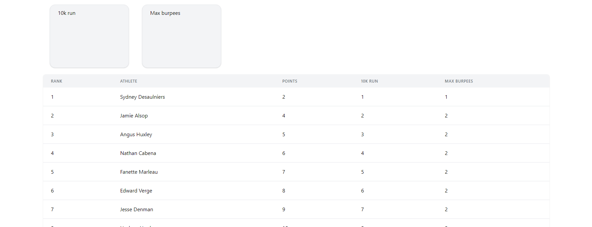

# University Project

Name | Student Number | Email
-----|----------------|------
Chloé Dumas | 300072427 | dduma032@uottawa.ca

[Livrable 1](livrable1/README.md)
[Livrable 2](livrable2/README.md)

## Deliverable 2

Mark | Description | Comment
---|---|---
2.0 | ER Model | See below
2.0 | Relational Model / Schema SQL | See below
2.0 | SQL seed/ examples / migrations |  
2.0 | Application |  
1.0 | README.md has all info | Yes
1.0 | Using git | Yes
/10 | |

J'ai utilisé LucidChart pour faire les diagrammes.

NOTE : J'ai manqué de temps pour implémenter les POST, DELETE et PUT de mon site. Je n'ai aussi pas eu le temps de mettre à jour les migrations. Certaines composantes ne sont pas complétées à 100%, mais le tout va être terminé lors du livrable 4.

J'ai utilisé Postgres pour la base de données et expressjs avec react pour l'application (voir à la fin pour l'installation).

### Diagramme ER

NOTE : les table avec des pointiers représentent des views.


### Diagramme relationnel


### Schema SQL

NOTE : Pour voir la liste de tous les `CREATE TABLE`, voir le fichier `schema.sql`.

La base de données a été créé avec Postgres.
Soit entrer la ligne sql suivante ou créer la base de données avec pgAdmin.

```sql
CREATE DATABASE crossfit;
```

Une fois la base de données créé, c'est possible d'utiliser le schema.sql afin de créer tous les schémas.

Les lignes SQL suivante vont créer le schéma athletes.

```sql
CREATE SEQUENCE IF NOT EXISTS athlete_id;
CREATE TABLE athletes (
    athlete_id integer PRIMARY KEY DEFAULT nextval('athlete_id'),
    identifier VARCHAR(100) UNIQUE NOT NULL DEFAULT md5(random()::text),
    created DATE DEFAULT NOW(),
    modified DATE DEFAULT NOW(),
    name VARCHAR(200),
    date_of_birth DATE,
    gender VARCHAR(30),
    height NUMERIC(4, 1),
    weight NUMERIC(4, 1),
    nationality VARCHAR(100)
);
```

Les lignes suivantes vont créer le schéma competitions.

```sql
CREATE SEQUENCE IF NOT EXISTS competition_id;
CREATE TABLE competitions (
    competition_id integer PRIMARY KEY DEFAULT nextval('competition_id'),
    identifier VARCHAR(100) UNIQUE NOT NULL DEFAULT md5(random()::text),
    created DATE DEFAULT NOW(),
    modified DATE DEFAULT NOW(), 
    name VARCHAR(200),
    start_date DATE,
    end_date DATE,
    amount_events INTEGER,
    contact_person_id INTEGER NOT NULL REFERENCES contact_persons(id),
    address_id INTEGER NOT NULL REFERENCES addresses(id),
    partner_id INTEGER NOT NULL REFERENCES partners(id)
);
```

La ligne suivante va créer le schéma registrations (relie les athlètes aux compétitions).

```sql
CREATE TABLE registrations (
    competition_id INTEGER,
    athlete_id INTEGER,
    registration_date DATE DEFAULT NOW(),
    PRIMARY KEY (competition_id, athlete_id),
    CONSTRAINT fk_competition FOREIGN KEY (competition_id) REFERENCES competitions(competition_id) ON DELETE CASCADE,
    CONSTRAINT fk_athlete FOREIGN KEY (athlete_id) REFERENCES athletes(athlete_id) ON DELETE CASCADE
);
```

### Exemple de SQL
Voir ./SQL/test_livrable3.sql

#### INSERT

La ligne sql suivante ajoute quelques athletes.

NOTE : Exécuter le fichier seeds.sql pour avoir la liste complète des seeds.

```sql
INSERT INTO athletes (name, gender)
VALUES ('Sydney Desaulniers', 'female'),
    ('Mercer Bussiere', 'female'),
    ('Fiacre Doiron', 'female'),
    ('Thérèse Lemaître', 'female'),
    ('Coralie Faucher', 'female');
```

Les lignes sql suivantes ajoutent une personne contact, une addresse et un partenaire.

```sql
-- insert contact person
INSERT INTO contact_persons (name, email, phone) values ('Dan', 'info@crossfitfortis.ca', '6138370909');

-- insert address
INSERT INTO addresses(street_number, street, city, postal_code, province) values ('245', 'Vanguard Dr', 'Orléans', 'K4A3V6', 'Ontario');

-- insert partner
WITH contact AS (
    SELECT id FROM contact_persons WHERE name = 'Dan' AND email = 'info@crossfitfortis.ca' AND phone = '6138370909'
), address AS (
    SELECT id FROM addresses WHERE street_number = '245' AND street = 'Vanguard Dr'     AND city = 'Orléans' AND postal_code = 'K4A3V6' AND province = 'Ontario'
) INSERT INTO partners (name, contact_person_id, address_id) SELECT 'CrossFit Fortis', (select id from contact), (select id from address);
```

La ligne sql suivante ajoute 1 compétition.

```sql
INSERT INTO competitions (name, start_date, end_date, contact_person_id, address_id, partner_id)
SELECT
    'Canada Day 2021',
    '2021-07-01',
    '2021-07-01',
    (SELECT id FROM contact_persons WHERE name = 'Dan' AND email = 'info@crossfitfortis.ca' AND phone = '6138370909'),
    (SELECT id FROM addresses WHERE street_number = '245' AND street = 'Vanguard Dr'     AND city = 'Orléans' AND postal_code = 'K4A3V6' AND province = 'Ontario'),
    (select id from partners where name = 'CrossFit Fortis');
```

La ligne sql suivante ajoute une capacity à une compétition.

```sql
-- insert capacity
INSERT INTO capacity (competition_id, gender, capacity)
SELECT
    (select competition_id from competitions where name = 'Canada Day 2021'),
    'female',
    45;
```

La ligne sql suivante inscrit 1 athlète à 1 compétition.

```sql
INSERT INTO registrations (competition_id, athlete_id)
SELECT (
        SELECT competition_id
        FROM competitions
        WHERE name = 'Canada Day 2021'
    ),
    (
        SELECT athlete_id
        FROM athletes
        WHERE name = 'Sydney Desaulniers'
    );
```

Les lignes suivante créent un workout (10km run).

```sql
-- insert workouts
INSERT INTO workouts (name, score)
VALUES ('10k run', 'Time ASC');

-- insert movements
INSERT INTO movements (name, TYPE, cap)
VALUES ('running', 'distance', '10000');

-- insert workout_movements
INSERT INTO workout_movements (workout_id, movement_id, sequence_number)
SELECT (
        SELECT id
        FROM workouts
        WHERE name = '10k run'
    ),
    (
        SELECT id
        FROM movements
        WHERE name = 'running'
            AND TYPE = 'distance'
            AND cap = '10000'
    ),
    1;
```

Maintenant on va ajouter un workout à un événement.

```sql
-- insert events
INSERT INTO EVENTS (competition_id, event_name, workout_id)
SELECT (
        SELECT competition_id
        FROM competitions
        WHERE name = 'Canada Day 2021'
    ),
    '10k run',
    (
        SELECT id
        FROM workouts
        WHERE name = '10k run'
    );
```

Ensuite on ajoute le résultat de Sydney Desauilniers (50 minutes).

```sql
-- insert results
WITH event AS (
    SELECT competition_id,
        event_name
    FROM EVENTS
    WHERE event_name = '10k run'
)
INSERT INTO results (athlete_id, event_name, competition_id, score)
SELECT (
        SELECT athlete_id
        FROM athletes
        WHERE name = 'Sydney Desaulniers'
    ),
    event_name,
    competition_id,
    '5000'
FROM event;
```

Après l'insertion de plusieurs athlètes (**en utilisant le fichier `seed.sql`**), on obtient un leaderboard pour chaque événement.

```sql
select * from scores;
```

competition_name | event_name | athlete_name | rank | result_score | workout_score | result_secondary_score | workout_secondary_score
------- | ------- | ------- | ------- | ------- | ------- | ------- | -------
Canada Day 2021 | 10k run | Sydney Desaulniers | 1 | 5000 | Time ASC |  | 
Canada Day 2021 | 10k run | Jamie Alsop | 2 | 5118 | Time ASC |  | 
Canada Day 2021 | 10k run | Angus Huxley | 3 | 5239 | Time ASC |  | 
Canada Day 2021 | 10k run | Nathan Cabena | 4 | 5245 | Time ASC |  | 
Canada Day 2021 | 10k run | Fanette Marleau | 5 | 5248 | Time ASC |  | 
...                              |...                      |...           |...    |...|...|...|...
Canada Day 2021 | 10k run | Daniel Luke | 19 | 6354 | Time ASC |  | 
Canada Day 2021 | 10k run | Jack Hannam | 20 | 6456 | Time ASC |  | 
Canada Day 2021 | 10k run | Lily Oldham | 21 | 6506 | Time ASC |  | 
Canada Day 2021 | 10k run | Emily Prieur | 21 | 6506 | Time ASC |  | 
Canada Day 2021 | 10k run | Bethany Kingsford | 21 | 6506 | Time ASC |  | 
Canada Day 2021 | 10k run | Eva Clarkson | 21 | 6506 | Time ASC |  | 
Canada Day 2021 | 10k run | Leah Tims | 21 | 6506 | Time ASC |  | 
Canada Day 2021 | 10k run | Bailey Monckton | 26 | 6758 | Time ASC |  | 
Canada Day 2021 | 10k run | Grace Amess | 27 | 6805 | Time ASC |  | 
...                              |...                      |...           |...    |...|...|...|...
Canada Day 2021 | 10k run | Taj Stapleton | 39 | 7828 | Time ASC |  | 
Canada Day 2021 | 10k run | Coralie Faucher | 40 | 8012 | Time ASC |  | 
Canada Day 2021 | 10k run | Fiacre Doiron | 41 |  | Time ASC |  | 
Canada Day 2021 | 10k run | Mercer Bussiere | 41 |  | Time ASC |  | 
Canada Day 2021 | Max burpees | Sydney Desaulniers | 1 | 76 | Reps DESC |  | 
Canada Day 2021 | Max burpees | Emily Prieur | 2 |  | Reps DESC |  | 
Canada Day 2021 | Max burpees | Angus Huxley | 2 |  | Reps DESC |  | 
Canada Day 2021 | Max burpees | Taj Hillary | 2 |  | Reps DESC |  | 
Canada Day 2021 | Max burpees | Daniel Luke | 2 |  | Reps DESC |  | 
Canada Day 2021 | Max burpees | David Macalister | 2 |  | Reps DESC |  | 
Canada Day 2021 | Max burpees | Thomas Love | 2 |  | Reps DESC |  | 
...                              |...                      |...           |...    |...|...|...|...
Canada Day 2021 | Max burpees | Apolline Deschênes | 2 |  | Reps DESC |  | 
Canada Day 2021 | Max burpees | Coralie Faucher | 2 |  | Reps DESC |  | 
Canada Day 2021 | Max burpees | Thérèse Lemaître | 2 |  | Reps DESC |  | 
Canada Day 2021 | Max burpees | Fiacre Doiron | 2 |  | Reps DESC |  | 
Canada Day 2021 | Max burpees | Mercer Bussiere | 2 |  | Reps DESC |  | 

On peut voir qu'on a un rank pour chaque événement. Tous ceux qui n'ont pas entré de score pour l'événement 'Max Burpees' on eu un rank de 2. Si des athlètes sont égaults, ils ont tous le même rank.

Après l'insertion de plusieurs athlètes (**en utilisant le fichier `seed.sql`**), on obtient un leaderboard  pour chaque événement.

```sql
select * from leaderboard;
```

competition_name | rank | athlete_name | points
---|---|---|---
Canada Day 2021|1|Sydney Desaulniers|2
Canada Day 2021|2|Jamie Alsop|4
Canada Day 2021|3|Angus Huxley|5
Canada Day 2021|4|Nathan Cabena|6
Canada Day 2021|5|Fanette Marleau|7
...|...|...|...
Canada Day 2021|36|Charles Feldt|38
Canada Day 2021|37|Philippine Bordeleau|39
Canada Day 2021|38|Brodie Tedbury|40
Canada Day 2021|39|Taj Stapleton|41
Canada Day 2021|40|Coralie Faucher|42
Canada Day 2021|41|Mercer Bussiere|43
Canada Day 2021|41|Fiacre Doiron|43

On peut voir le leaderboard de la compétition Canada Day 2021, ou Sydney Desaulniers à obtenu 2 points car elle est arrivé première au 2 événement de la compétition.

#### UPDATE

La ligne SQL suivante mets à jour la grandeur de l'athlete Sansone Donaway

```sql
UPDATE athletes
SET height = 172.8
WHERE name = 'Sansone Donaway';

select * from athletes where name = 'Sansone Donaway';
```

Résultat après l'exécution

id|name|date_of_birth|gender|height|weight|identifier|created|modified|nationality
--|----|-------------|------|------|------|----------|-------|--------|-----------
1|Sansone Donaway|2000-05-24|male|172.8|89.6|asdflkwe|2021-02-23|2021-02-23|Canada

#### DELETE

La ligne sql suivante efface une enregistrement d'un athlète à une compéitions.

```sql
DELETE FROM registrations r
WHERE (select id from athletes where name = 'Milissent Prazer') = r.athlete_id 
AND (select id from competitions where name = 'Competition mai') = r.competition_id;

select a.name, r.*, c.name from athletes a 
full join registrations r on a.id = r.athlete_id 
full join competitions c on r.competition_id = c.id;
```

Résultat après l'exécution DELETE

athlete name|competition_id|athlete_id|competition name
----|--------------|----------|--------
Sansone Donaway|1|1|Competition mai
Rolfe Pigram|2|7|Competition mars
Nicolis Brickham|2|6|Competition mars
Milissent Prazer|2|2|Competition mars
Scotti Sleford|null|null|null
Garvy Eakens|null|null|null
Kippy Toman|null|null|null

On peut remarquer que l'athlète Milissent Prazer n'est plus enregistré à la compétition 'Competition mai'.


## Installer le site web sur un système mac 

1. Installer postgres 
Aller sur le site https://www.postgresql.org/download/ et installer postgres 13
**Il faut se souvenir du password et du port**

2. Installer Node.js (et npm) car le site est fait avec react et express
Aller sur le site https://nodejs.org/en/ et installer Node.js

3. Base de données

- Ovrir une shell psql

- Si psql dans le terminal retourne l'erreur 'command not found', le PATH n'a peut être pas bien été installé. Donc il faut ajouter 'export PATH="/Library/PostgreSQL/13/bin:$PATH"' dans le ~/.zshrc ou ~/.bashrc dépendant si le terminal utilise zsh ou bash

- Utiliser le terminal se connecter à postgres avec la ligne
```zsh
psql -h HOST -p PORT -U postgres -W
```
remplacer HOST par 'localhost'
remplacer PORT par le port établie lors de l'installation (par défault 5432)

- Une fois connecté, il faut créer la base de données (crossfit)
```zsh
create database crossfit
ou
createdb crossfit
```

- faire exit afin de sortir de psql et cd au dossier du projet
```zsh
exit [return]
cd **path to projct**
```
remplacer HOST par 'localhost'
remplacer PORT par le port établie lors de l'installation (par défault 5432)

- maintenant executer les fichiers dans cet ordre
```psql
psql -h localhost -p 5432 -U postgres -W -d crossfit -f ./SQL/schema.sql
psql -h localhost -p 5432 -U postgres -W -d crossfit -f ./SQL/seed.sql
```

- base de donnes terminé

4. Installer le site

- Traverser au projet avec 'cd'
- Installer les packages
  Du root './'
```zsh
cd App/crossfit
npm i
```
5. Modifier les info pour la connection 
- Aller à './App/crossfit/package.json' et modifier port au besoin dans le script "dev"
- Aller à './App/crossfit/pgConfig.js' et modifier les valeurs au besoin

6. Exécuter le site web

   Il faut s'assurer l'utilisation du port 5432 pour la base de données Postgres.
- cd ./App/crossfit
- exécuter 'npm run dev'
- attendre un moment jusqu'à temps que le terminal affiche 'event - compiled successfully'
- visiter le site web a 'http://localhost:3005'


## Démonstration du site web fonctionnel

Vue athlètes par id


Vue compétitions


Vue créer un athlète


Il y possibilité de changer l'ordre d'affichage des tableaux des athlètes et compétitions (name asc)


Si on clique sur le nom d'un athlète, on va à son informations


Si on clique sur le nom d'une compétition, on va à la description de la compétition (et la liste des athlètes inscrit)


On voit aussi un leaderboard pour cette compétition et les événements.

