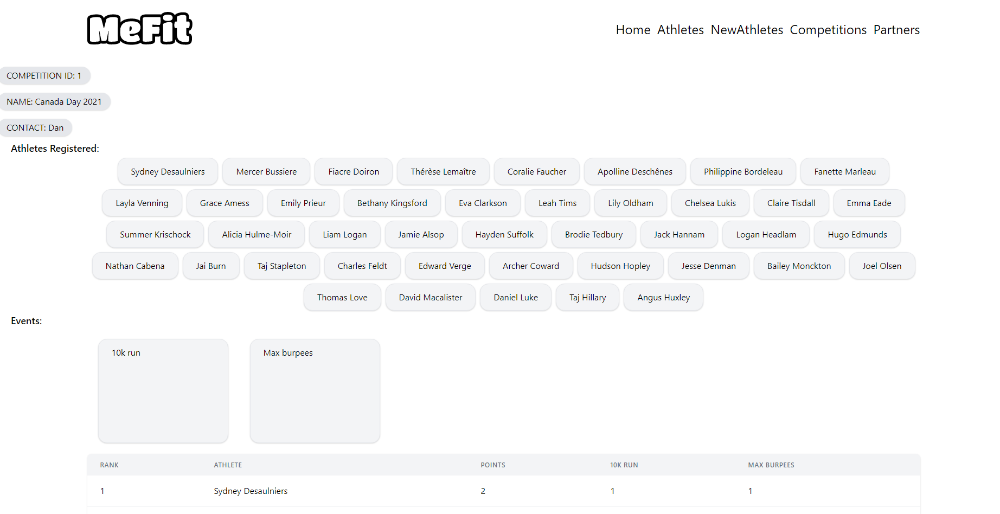

# University Project

Name | Student Number | Email
-----|----------------|------
Chloé Dumas | 300072427 | dduma032@uottawa.ca

[Livrable 1](livrable1/README.md)

## Deliverable 2

J'ai utilisé LucidChart pour faire les diagrammes.

J'ai utilisé Postgres pour la base de données et expressjs avec react pour l'application (voir à la fin pour l'installation).


### Diagramme ER


### Diagramme relationnel


### Schema SQL

La base de données a été créé avec Postgres.
Soit entrer la ligne sql suivante ou créer la base de données avec pgAdmin.
Une fois la base de données créé| c'est possible d'utiliser le schema.sql afin de créer tous les schémas.

```sql
CREATE DATABASE crossfit;
```

Les lignes SQL suivante vont créer le schéma athletes.

```sql
CREATE SEQUENCE IF NOT EXISTS athlete_id;

CREATE TABLE IF NOT EXISTS athletes (
    id integer PRIMARY KEY DEFAULT nextval('athlete_id')|
    name VARCHAR(200)|
    date_of_birth DATE|
    gender VARCHAR(30)|
    height NUMERIC(4| 1)|
    weight NUMERIC(4| 1)|
    identifier VARCHAR(20) UNIQUE NOT NULL|
    created DATE|
    modified DATE|
    nationality VARCHAR(100)
);
```

Les lignes suivantes vont créer le schéma competitions.

```sql
CREATE SEQUENCE IF NOT EXISTS competition_id;

CREATE TABLE IF NOT EXISTS competitions (
    id integer PRIMARY KEY DEFAULT nextval('competition_id')|
    name VARCHAR(200)|
    venue VARCHAR(200)|
    identifier VARCHAR(20) UNIQUE NOT NULL|
    start_date_time DATE|
    end_date_time DATE|
    created DATE|
    modified DATE
);
```

La ligne suivante va créer le schéma registrations (relie les athlètes aux compétitions).

```sql
CREATE TABLE IF NOT EXISTS registrations (
    competition_id INTEGER|
    athlete_id INTEGER|
    PRIMARY KEY (competition_id| athlete_id)|
    CONSTRAINT fk_competition FOREIGN KEY (competition_id) REFERENCES competitions(id) ON DELETE CASCADE|
    CONSTRAINT fk_athlete FOREIGN KEY (athlete_id) REFERENCES athletes(id) ON DELETE CASCADE
);
```

### Exemple de SQL

#### INSERT

La ligne sql suivante ajoute 7 athletes.

```sql
INSERT INTO athletes (name| date_of_birth| gender| height| weight| identifier| created| modified| nationality) 
VALUES 
    ('Sansone Donaway'|  '2000-05-24'| 'male'|       171.4|  89.6| 'asdflkwe'| '2021-02-23 19:17:00'| '2021-02-23 19:17:00'| 'Canada'    )|
    ('Milissent Prazer'| '1999-02-26'| 'female'|     155.4|  69.0| 'alsdfkje'| '2021-02-23 19:17:00'| '2021-02-23 19:17:00'| 'Canada'    )|
    ('Kippy Toman'|      '1991-04-03'| 'female'|     154.1|  73.5| 'clvjwo'|   '2021-02-23 19:17:00'| '2021-02-23 19:17:00'| 'États-Unis')|
    ('Garvy Eakens'|     '1999-01-03'| 'male'|       168.5|  96.1| 'lakjve'|   '2021-02-23 19:17:00'| '2021-02-23 19:17:00'| 'France'    )|
    ('Scotti Sleford'|   '1995-08-02'| 'male'|       179.2|  99.6| 'slvjeew'|  '2021-02-23 19:17:00'| '2021-02-23 19:17:00'|'États-Unis' )|
    ('Nicolis Brickham'| '1977-02-12'| 'non-binary'| 178.4|  80.1| 'vlkjewo'|  '2021-02-23 19:17:00'| '2021-02-23 19:17:00'| 'Canada'    )|
    ('Rolfe Pigram'|     '1986-03-07'| 'male'|       175.5|  75.0| 'vlwkjei'|  '2021-02-23 19:17:00'| '2021-02-23 19:17:00'| 'Canada'    );
```

La ligne sql suivante ajoute 2 compétitions.

```sql
INSERT INTO competitions (name| venue| start_date_time| end_date_time| created| modified| identifier)
VALUES
    ('Competition mai'|  'Ottawa'|   '2021-05-01'| '2021-05-02'| '2021-02-23 19:17:00'| '2021-02-23 19:17:00'| 'lsdkfjio')|
    ('Competition mars'| 'Gatineau'| '2021-03-13'| '2021-03-13'| '2021-02-23 19:17:00'| '2021-02-23 19:17:00'| 'wsldjio' );
```

La ligne sql suivante inscrit des athlètes à des compétitions.

```sql
INSERT INTO registrations (competition_id| athlete_id)
VALUES
    (1| 1)|
    (1| 2)|
    (2| 7)|
    (2| 6)|
    (2| 2);
```

Résultat après l'exécution de full join entre les trois tables.

```sql
select a.name| r.*| c.name from athletes a full join registrations r on a.id = r.athlete_id full join competitions c on r.competition_id = c.id;
```

athlete name | athlete id|competition id|competition name
-------------|-----------|--------------|----------------
Sansone Donaway | 1 | 1 | Competition mai | 
Milissent Prazer | 2 | 1 | Competition mai | 
Rolfe Pigram | 7 | 2 | Competition mars | 
Nicolis Brickham | 6 | 2 | Competition mars | 
Milissent Prazer | 2 | 2 | Competition mars | 
Scotti Sleford | NULL | NULL | NULL | 
Garvy Eakens | NULL | NULL | NULL | 
Kippy Toman | NULL | NULL | NULL

On peut voir que les athlètes| compétitions et les enregistrements ont tous bien été mis dans la base de données. On peut aussi voir qu'ils sont liées ensemble.

#### UPDATE

La ligne SQL suivante mets à jour la grandeur de l'athlete Sansone Donaway

```sql
UPDATE athletes
SET height = 172.8
WHERE name = 'Sansone Donaway';

select * from athletes where name = 'Sansone Donaway';
```

Résultat après l'exécution

id|name|date_of_birth|gender|height|weight|identifier|created|modified|nationality
--|----|-------------|------|------|------|----------|-------|--------|-----------
1|Sansone Donaway|2000-05-24|male|172.8|89.6|asdflkwe|2021-02-23|2021-02-23|Canada

#### DELETE

La ligne sql suivante efface une enregistrement d'un athlète à une compéitions.

```sql
DELETE FROM registrations r
WHERE (select id from athletes where name = 'Milissent Prazer') = r.athlete_id 
AND (select id from competitions where name = 'Competition mai') = r.competition_id;

select a.name, r.*, c.name from athletes a 
full join registrations r on a.id = r.athlete_id 
full join competitions c on r.competition_id = c.id;
```

Résultat après l'exécution DELETE

athlete name|competition_id|athlete_id|competition name
----|--------------|----------|--------
Sansone Donaway|1|1|Competition mai
Rolfe Pigram|2|7|Competition mars
Nicolis Brickham|2|6|Competition mars
Milissent Prazer|2|2|Competition mars
Scotti Sleford|null|null|null
Garvy Eakens|null|null|null
Kippy Toman|null|null|null

On peut remarquer que l'athlète Milissent Prazer n'est plus enregistré à la compétition 'Competition mai'.


## Installer le site web sur un système mac 

1. Installer postgres 
Aller sur le site https://www.postgresql.org/download/ et installer postgres 13
**Il faut se souvenir du password et du port**

2. Installer Node.js (et npm) car le site est fait avec react et express
Aller sur le site https://nodejs.org/en/ et installer Node.js

3. Base de données

- Ovrir une shell psql

- Si psql dans le terminal retourne l'erreur 'command not found', le PATH n'a peut être pas bien été installé. Donc il faut ajouter 'export PATH="/Library/PostgreSQL/11/bin:$PATH"' dans le ~/.zshrc ou ~/.bashrc dépendant si le terminal utilise zsh ou bash

- Utiliser le terminal se connecter à postgres avec la ligne
```zsh
psql -h HOST -p PORT -U postgres -W
```
remplacer HOST par 'localhost'
remplacer PORT par le port établie lors de l'installation (par défault 5432)

- Une fois connecté, il faut créer la base de données (crossfit)
```zsh
create database crossfit
```

- faire exit afin de sortir de psql et cd au dossier du projet
```zsh
exit [return]
cd **path to projct**
```
remplacer HOST par 'localhost'
remplacer PORT par le port établie lors de l'installation (par défault 5432)

- maintenant executer les fichiers dans cet ordre
```psql
psql -h localhost -p 5432 -U postgres -W -d crossfit -f ./SQL/schema.sql
psql -h localhost -p 5432 -U postgres -W -d crossfit -f ./SQL/seed_athletes.sql
psql -h localhost -p 5432 -U postgres -W -d crossfit -f ./SQL/seed_competitions.sql
psql -h localhost -p 5432 -U postgres -W -d crossfit -f ./SQL/seed_registrations.sql
```

- base de donnes termine

4. Installer le site

- Traverser au projet avec 'cd'

- Installer les packages
Du root './'
```zsh
npm i
```
Du frontend './App/frontend'
```zsh
cd App/frontend
npm i
```
et du backend './App/backend'
```zsh
cd ../backend
npm i
```
ensuite important de retourner au root avec
```zsh
cd ../..
```

5. Modifier les info pour la connection 
- Aller à './App/backend/queries.js' et modifier port à la valeur établie lors de l'installation de postgres
- Aller à './App/backend/queries.js' et modifier password au password établie lors de l'installation de postgres
- S'assurer que les ports 8080 (backend) et 3000 (frontend) sont librent (sinon modifier à 'App/backend/index.js' et à 'App/frontend/.env')

6. Exécuter le site web
- cd au root du projet
- exécuter 'npm start'
- attendre un moment jusqu'à temps que le terminal affiche 'You can now view frontend in the browser. http://localhost:3000'
- visiter le site web a 'http://localhost:3000'


## Démonstration du site web fonctionnel

Vue athlètes par id


Vue compétitions


Vue créer un athlète


Vue athlètes après l'ajout d'un athète


Il y possibilité de changer l'ordre d'affichage des tableaux des athlètes et compétitions (name asc)


On peut aussi rechercher un athlète par nom


Si on clique sur le nom d'un athlète, on va à son informations


Si on clique sur le nom d'une compétition, on va à la description de la compétition (et la liste des athlètes inscrit)



